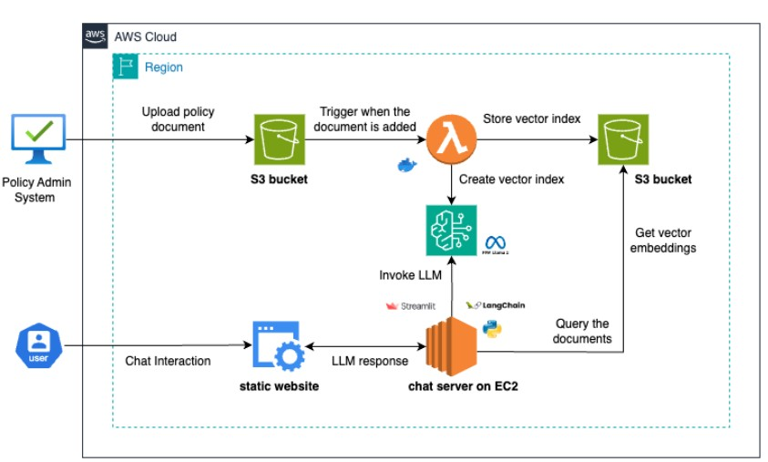

## **Insurance Virtual Agent 🚀**

### **Overview**

This project is about Insurance Virtual Agent which can help insured to find the details regardings their policy.

Insurance is a document-heavy industry with numerous terms and conditions, making it challenging for policyholders to find accurate answers to their queries regarding policy details or the claims process. This often leads to higher customer churn due to frustration and misinformation. This article explores how to address this issue using Generative AI by building an end-to-end advance Retrieval-Augmented Generation (RAG) chatbot for insurance. We call it IVA(Insurance Virtual Agent), which is built over the robust AWS stack.

### **Process**

1. When a policy is issued, the policy document is stored in an aws S3 bucket.
2. An S3 notification triggers a aws Lambda function upon document upload. This function   tokenizes the document, generates vector embeddings, and store it in pineconne vector db.
3. When a user queries the chatbot, it retrieves the relevant vector index based on the policy number. The chatbot then uses this index and the user’s query, processed through a advanced algorithm which is called self-rag which has agent capabilities, to generate more accurate, relevant, and useful response.

### Architecture

### **Key Features**
✅ Conversational AI – Engages users in natural conversations.  
✅ Agentic and self-RAG workflow – Dynamically adapts to user queries
✅ RAG System for Policies – Retrieves accurate policy information using Pinecone and LangChain.  
✅ Metadata Filtering – Optimizes search accuracy for insurance documents.  
✅ Hybrid Search Support – Combines dense and sparse embeddings for better relevance.  
✅ AWS-Powered Deployment – Runs efficiently on AWS Lambda and EC2.

### **Tech Stack**
🔹 Programming Language: Python    
🔹 Embedding Models: llama-text-embed-v2 (Pinecone-hosted), pinecone-sparse-english-v0 (Pinecone)  
🔹 LLM Model: gpt-4o (OpenAI)  
🔹 Indexing: Pinecone Vector DB, LangChain, LlamaParse, AWS Lambda, AWS S3  
🔹 RAG: Pinecone, LangChain, Langgraph  
🔹 Deployment: Docker, AWS EC2  
🔹 Front-end: Streamlit + FastAPI  

### Application Graph

### **Setup Instructions**

#### **Setup AWS resources**
1. Create S3 bucket (rag-source-bucket13).
2. Create policy to enable the lambda to get s3 object(policy documents) and do the 
    processing. policy name -> (s3-trigger-lambda)
    Add below services to this policy
    Bedrock
    CloudWatch Logs
    S3
3. Create execution role that grants a lambda function permission to access aws resources  and services.In this step, create an execution role using the permissions policy that you created in the previous step. role -> (s3-trigger-lambda-role)
Add the below permissions.
    AWSLambdaVPCAccessExecutionRole
    SecretsManagerReadWrite
    AWSLambdaBasicExecutionRole
    s3-trigger-lambda
4.  Create lambda function to have the logic of indexing the policy document in RAG process. This function automatically triggered by S3 to create the embeddings of policy document and store it in the pineconne vectore db.
    lambda function -> (Insurance-Virtual-Assistant)
    logic has been written in lambda_function.py file
5. Create secrets in secretmanagers to store the pinecone api key and llama api key. -> (pinecone_api_key) 

6. Create Docker Image

Wrap the lambda function with its dependencies and create the docker image.
1. Create lambda_fucntion.py, Dockerfile, requirements.txt as shown in lambdasetup directory. 
2. Create the aws ecr repository.
3. Build the docker image from dockerfile and push it to aws ecr repo.
4. Create aws lambda function using docker container option and attach the image.

7. Add triggers : Add trigger to trigger the lambda function whenever policy documents gets
    created in S3 bucket.

    Use below link to follow the steps
    https://docs.aws.amazon.com/lambda/latest/dg/with-s3-example.html

### **Usage Guide**

### **Query Insurance Policies**

### **Links**

Below are some docs which are useful in this project.

1. [Pinecone Hybrid Search](https://docs.pinecone.io/guides/search/hybrid-search)
2. [S3 Trigger to invoke lambda](https://docs.aws.amazon.com/lambda/latest/dg/with-s3-example.html)
3. [Lambda Layers](https://docs.aws.amazon.com/lambda/latest/dg/python-layers.html)

